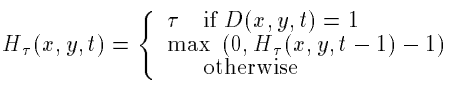

# commaai-speed-challenge
:oncoming_automobile: Solving comma.ai's speed prediction challenge.

## Overview

My solution is based on a Computer Vision technique known as **Motion History Images**. This technique was proposed by Aaron Bobick and James Davis in the late 90's. The main idea was to capture the movement in images throughout some predefined time period.

In particular, an MHI is constructed by assigning a value  to the pixels that exhibit movement with respect to the _previous_ frame. And decaying the _previous_ values of those pixels that don't. This is expressed using the following formula:

  

where  is a binary image describing whether there is motion at time  or not.

The motion threshold, for computing the binary images, and  are hyperparameters.

Originally, Bobick and Davis applied this technique to human action recognition. However, I decided to apply it to this problem under the hypothesis that the MHI's could describe the _change_ in motion of the vehicle, and therefore be able to predict its speed. My theory was that if the vehicle is moving slowly then the pixels in the MHI would exhibit more decayment (i.e. more "gray areas"). On the other hand, if the vehicle is moving faster then the MHI would look brighter since more pixels would be assigned the max value of . The following image shows an example of an MHI for the training video.

  

## Model Architecture

  

I used a pre-trained **ResNet-18** model, modifying the last layer to output a single real value (instead of the Softmax classification). This value is the predicted speed.

One more important aspect to note is that since the network takes in color (3-channel) images, the MHI is replicated across the 3 channels. As shown in the figure above.

## Results

The model achieves an MSE of **~5.22** on a dev set of frames obtained from a random split of the training video.

Since the correct speeds for the testing video aren't available, I can't report the MSE. I produced a new video, from the original `test.mp4`, with all frames tagged with their speed. After inspecting it visually, it seems that the model might not actually perform as well as I had expected though.

## Future Work

One of the main issues with my approach is that the MHI's don't take into account the _direction_ of movement. When the vehicle is stopped and cars are crossing in front of it, the motion is captured in the MHI. This causes the model to predict speed values incorrectly. One potential way of addressing this is by using **Directed Motion History Images**; an extension to the original technique that takes direction into account.

On the other hand, as mentioned above, the idea of using Motion History Images didn't prove as fruitful as I had hoped. Therefore, another avenue for future research is to move away completely from this technique. An idea that could be explored, for example, is feeding in Optical Flow images instead.

## References

- _The Representation and Recognition of Action
Using Temporal Templates_ by Aaron Bobick and James Davis, 1997.